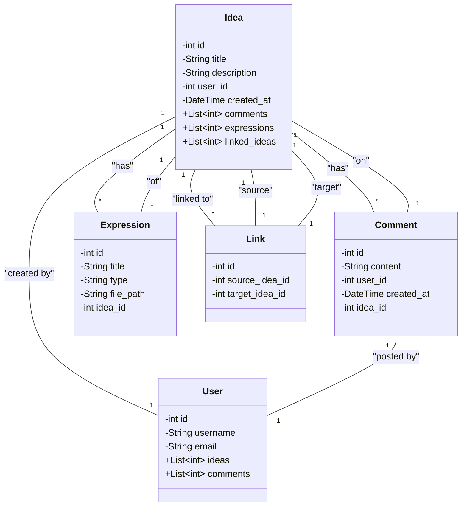

# Open Creative Idea

## 概要

((後日追記))

## コンセプト

### 「アイデア」とは

「アイデア」は創作の触発となる「思考の種」としての役割を持つ。そのため、自由に利用・改変され、無限のパターンが作られることが想定される。
また、「アイデア」は文章で説明され、その「表現」が文章・画像をはじめとして将来的に増えるさまざまなフォーマットで提示される。

### 目的と利点

  - 目的: クリエイティブなアイデアとその表現方法を共有し、それらを通じて創造性を刺激する。
  - 利点: ユーザーは既存のアイデアを参考に新たな創作物を生み出すことができ、アイデアのオリジナル提案者も認識される。

### ターゲットユーザー

  - クリエイター、研究者、教育関係者、一般の創作愛好家など、アイデアを求めるあらゆるユーザー。

### 主要な機能

  - **アイデアの投稿と表示**: ユーザーは自らのアイデアやその表現方法を投稿でき、他のユーザーはこれらを閲覧できる。
  - **リンクと追跡機能**: 各アイデアは他のアイデアとリンクされ、ユーザーはこれらの関連性や派生を追跡できる。
    -  アイデアのインスピレーション関係を可視化し、そのアイデアのもとのアイデアや派生したアイデアに容易にアクセス可能。
  - **アイデアの検索とフィルタリング**: 特定のトピックやキーワードに基づいてアイデアを検索できる。
    - アイデアを入力して検索すると、そのアイデアとそこにリンクづけされたアイデアの一覧が関係度順に表示される。
    - 異なるアイデアがリンクづけされたアイデアを提示できるガチャによって予期しないインスピレーションを得られる。
    - アイデアはいくつかの基本的なカテゴリーによって分けられ、このカテゴリーは最小限で、リリースから増えることは稀。

### コンテンツの管理と著作権

  - すべての投稿されたアイデアや表現方法は、著作権が切れているか、著作者によって著作権が放棄されているものでなければならない。
  - プラットフォームは、著作権の侵害を防ぐための適切な管理システムを備える必要がある。

### ユーザーエクスペリエンス

1. **ガチャ画面でのインスピレーションの探索**
   - 初期アクセス時、ユーザーは「ガチャ」機能を使用してランダムなアイデアを探索します。
   - 除外キーワードを入力しないことで、多様なアイデアに触れる機会を得ます。

2. **アイデアの詳細ページ**
   - 選択されたアイデアの詳細ページには、アイデアの文章説明と関連する表現方法が表示されます。
   - このページには、そのアイデアに影響を与えたアイデアや、そのアイデアから派生したアイデアのリンクも含まれます。
   - コメントセクションでアイデアについて議論を行ったりQ&Aを行ったりができる。(Githubのissueな感じがいい？）

3. **アイデアの投稿とリンク**
   - ユーザーは新しいアイデアを投稿する際、参照履歴から関連するアイデアにチェックを入れ、リンクを作成します。
   - 既存のアイデアと重複しないことを確認した後、詳細を入力し投稿します。

4. **表現方法の投稿**
   - アイデアに関連する表現方法も投稿でき、これらは自動的にリンクされ、表示されます。

5. **審査プロセス**
   - 投稿されたアイデアと表現方法は審査を経て公開されます。
   - 審査は認定ユーザーと一般ユーザーにより行われ、AIの支援を受けて関連するアイデアの重複をチェックします。
   - 既存のアイデアとの重複がないかが判断される。

6. **リンクとコミュニティの寄与**
   - 投稿されたアイデアは、投稿者自身がリンクを作成しなくても、他のユーザーが類似性に基づいてリンクを追加できます。
  
## 設計

### フレームワーク

Djangoを用いる。

### データモデル

#### アイデアモデル

アイデアそのものであり、メインのモデル。このモデルは投稿者が外部キーとして存在する。関連アイデアやコメントは別のモデルによってリンクされる。
ユーザーモデルが削除された場合、そのアイデアの投稿者はサービス管理者が管理する DeletedUser に置き換えられる。DeletedUserは説明文先頭にユーザーの名前と削除ユーザーであることが明記される。
タイトル・説明・投稿者

### 表現モデル

アイデアをもとにした表現方法を記録するモデル。
データとしてアップロードして保存しておけるようにし、ランダムなファイル名がつけられ表現方法に応じたファイルに格納される。
表現の文章説明（タイトル)・表現方法のタイプ・ファイルパス

### ユーザーモデル

ユーザー管理を行うためのモデル。
ユーザー名・メールアドレス・プロフィール情報(年齢や性別などはいらない。復旧するのに必要な情報だけでいい)・管理ユーザーかどうか

### コメントモデル

コメントは各アイデアに対してリンクされ、アイデアページで表示される。
コメント内容・投稿者・投稿日時・関連アイデア

### リンクモデル

アイデア間の関連とインスピレーションの流れを示す。多対多の関係になるためリンクデータベースを作成する。
リンク元・リンク先・リンクのタイプ

